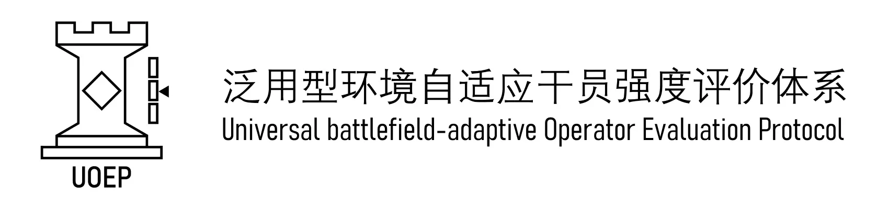
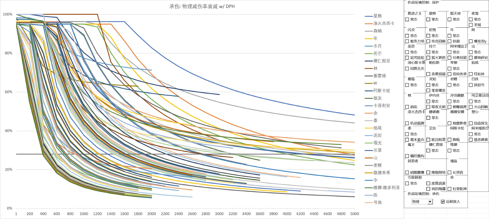

# 泛用型环境自适应干员强度评价体系

UOEP是一个可广泛用于明日方舟干员、随着游戏更新不断发展、涵盖各种环境和干员各项能力、一键自动计算干员强度的评价体系。

### 最新消息
- UOEP当前版本: v0.10.0，[去下载数据表](releases/latest.md)
- 网页版DPS计算器已发布，<a href="https://ark-dps.com">去体验  ArkDPS</a>

### 了解更多
- 我想了解干员强度 👉 [干员强度图](https://www.bilibili.com/opus/1156729212178006022)
- 我想计算干员伤害 👉 [数据使用方法](docs/数据使用方法.md)
- 我想学习计算原理 👉 [设计文档](docs/设计文档.md)

---

本项目的数据和文档采用知识共享署名—非商业性使用—相同方式共享4.0协议<a href="https://creativecommons.org/licenses/by-nc-sa/4.0/">1</a>授权，源代码采用GNU GPLv3协议<a href="https://www.gnu.org/licenses/gpl-3.0.en.html">2</a>授权。<a href="https://github.com/uoep/UOEP/issues/1">English version</a>

