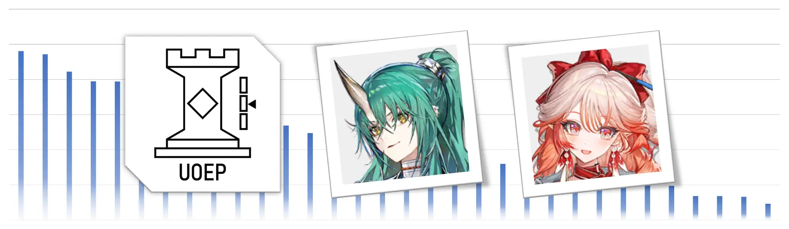

# v0.5.0: 斩业星熊、遥等 (2025/08/04)

下载表示您同意[协议](../licenses/EULA.md)
- [下载明日方舟干员伤害数据表](../data/%E6%98%8E%E6%97%A5%E6%96%B9%E8%88%9F%E5%B9%B2%E5%91%98%E4%BC%A4%E5%AE%B3%E6%95%B0%E6%8D%AE%E8%A1%A8.xlsb)（推荐，包含完整功能，需使用电脑打开）
- [下载明日方舟干员伤害数据表 Lite 版](../data/%E6%98%8E%E6%97%A5%E6%96%B9%E8%88%9F%E5%B9%B2%E5%91%98%E4%BC%A4%E5%AE%B3%E6%95%B0%E6%8D%AE%E8%A1%A8%20Lite.xlsx)（不推荐，包含精简内容，支持手机、平板等设备，仅建议硬件或软件不符合要求的用户使用）

### What's new
- 新增：收录干员：斩业星熊，遥
- 新增：收录敌人：便符，皮书生，平剑客，靳天师，似兽，怪葫芦，梁，坎某人，夕娥，双月共主，玉双剑，枣大刀，炭长矛，昭烈君，文衡君，桓君，师祖，太公，易，“岁”，“望”
- 修复：输出实战瞬间吃拐率数据不正确的问题
